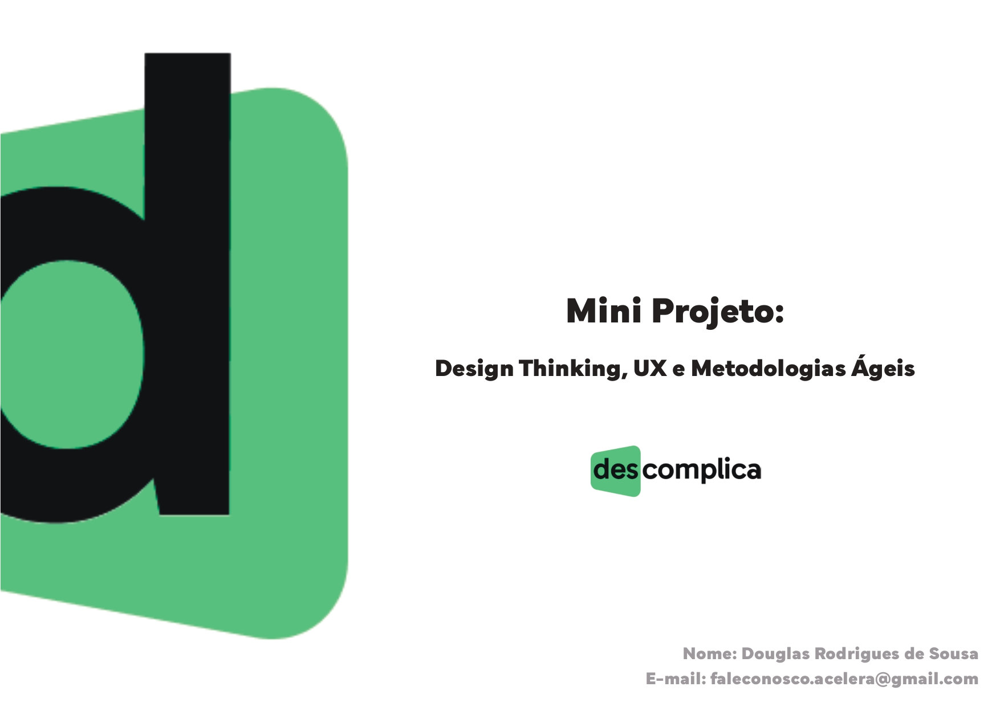

## Projeto - Design Thinking, UX e Metodologias Ágeis:

Um ponto que funciona como uma ponte entre o Design Thinking e a Metodologia Ágil no desenvolvimento da loja gamer é o foco no usuário e na interação contínu.

Ambas as abordagens têm como premissa central a importância de entender as necessidades e desejos dos usuários. No Design Thinking, o processo de empatia e compreensão profunda do público-alvo é essencial para identificar os problemas e oportunidades reais que devem ser abordados no desenvolvimento da loja gamer.

 

<a href="./Design-Thinking.pdf"> Link para o PDF do Projeto TESTE </a>

## Prototipo:

 

Ambas as abordagens têm como premissa central a importância de entender as necessidades e desejos dos usuários. No Design Thinking, o processo de empatia e compreensão profunda do público-alvo é essencial para identificar os problemas e oportunidades reais que devem ser abordados no desenvolvimento da loja gamer.

<a href="https://www.figma.com/file/qlXe1EwEA7hYc5IHNyDi8y/Prototipo----Descomplica?type=design&node-id=0-1&mode=design&t=rS9dOfGvf25SpMnx-0">Link para o FIGMA</a>

Qualquer duvida fale comigo: <a href="https://api.whatsapp.com/send/?phone=5581984548244&text&type=phone_number&app_absent=0"> Whatssap </a>
